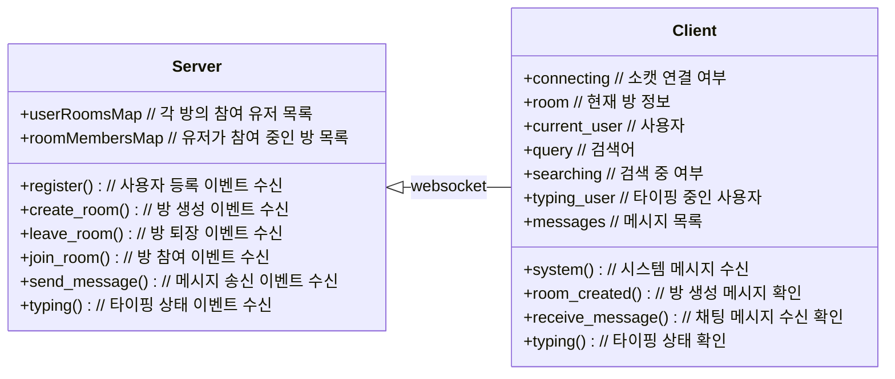
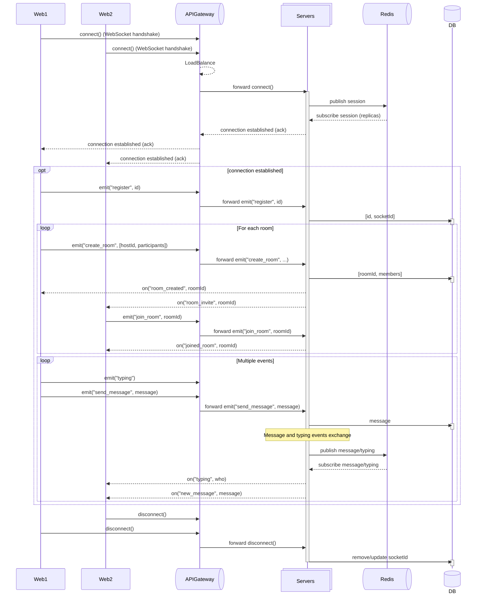

# Socket.IO 채팅 서비스

## 🚩 목차

- [🛠️ 기술 스택](#️-기술-스택)
- [💁 소개](#-소개)
- [🎥 데모](#-데모)
- [💡 주요 기능](#-주요-기능)
- [📊 다이어그램](#-다이어그램)
  - [🏗️ Architecture Diagram](#️-architecture-diagram)
  - [📡 Communication Diagram](#-communication-diagram)
  - [📐 Sequence Diagram](#-sequence-diagram)
- [🗂️ 서브 프로젝트](#%EF%B8%8F-서브-프로젝트)
- [🚀 실행 방법](#-실행-방법)

## 🛠️ 기술 스택

[](https://socket.io/)  
[](https://nestjs.com/)
[](https://redis.io)
[](https://nodejs.org/ko)
[](https://www.typescriptlang.org/)  
[](https://vuejs.org/)
[](https://ko.vite.dev)
[](https://pinia.vuejs.org/)
[](https://quasar.dev/)  
[![Steiger](https://img.shields.io/badge/FSD_Steiger-211b1d.svg?logo=data:image/svg+xml;base64,PD94bWwgdmVyc2lvbj0iMS4wIiBlbmNvZGluZz0iVVRGLTgiPz4KPHN2ZyB2ZXJzaW9uPSIxLjEiIHhtbG5zPSJodHRwOi8vd3d3LnczLm9yZy8yMDAwL3N2ZyIgd2lkdGg9IjIwMCIgaGVpZ2h0PSIyMDAiPgo8cGF0aCBkPSJNMCAwIEMyOC4zOCAwIDU2Ljc2IDAgODYgMCBDODYgMy42MyA4NiA3LjI2IDg2IDExIEM1Ny42MiAxMSAyOS4yNCAxMSAwIDExIEMwIDcuMzcgMCAzLjc0IDAgMCBaICIgZmlsbD0iI0VCRUFFQSIgdHJhbnNmb3JtPSJ0cmFuc2xhdGUoNTcsMTAyKSIvPgo8cGF0aCBkPSJNMCAwIEMyOC4zOCAwIDU2Ljc2IDAgODYgMCBDODYgMy42MyA4NiA3LjI2IDg2IDExIEM1Ny42MiAxMSAyOS4yNCAxMSAwIDExIEMwIDcuMzcgMCAzLjc0IDAgMCBaICIgZmlsbD0iI0VCRUFFQSIgdHJhbnNmb3JtPSJ0cmFuc2xhdGUoNTcsODcpIi8+CjxwYXRoIGQ9Ik0wIDAgQzI4LjM4IDAgNTYuNzYgMCA4NiAwIEM4NiAzLjYzIDg2IDcuMjYgODYgMTEgQzU3LjYyIDExIDI5LjI0IDExIDAgMTEgQzAgNy4zNyAwIDMuNzQgMCAwIFogIiBmaWxsPSIjRUJFQUVBIiB0cmFuc2Zvcm09InRyYW5zbGF0ZSg1Nyw1NykiLz4KPHBhdGggZD0iTTAgMCBDMjguMzggMCA1Ni43NiAwIDg2IDAgQzg2IDMuNjMgODYgNy4yNiA4NiAxMSBDNTcuNjIgMTEgMjkuMjQgMTEgMCAxMSBDMCA3LjM3IDAgMy43NCAwIDAgWiAiIGZpbGw9IiNFQkVBRUEiIHRyYW5zZm9ybT0idHJhbnNsYXRlKDU3LDQyKSIvPgo8cGF0aCBkPSJNMCAwIEMxMy41MyAwIDI3LjA2IDAgNDEgMCBDNDEgMy42MyA0MSA3LjI2IDQxIDExIEMyNy40NyAxMSAxMy45NCAxMSAwIDExIEMwIDcuMzcgMCAzLjc0IDAgMCBaICIgZmlsbD0iI0U5RThFOCIgdHJhbnNmb3JtPSJ0cmFuc2xhdGUoNTcsMTQ3KSIvPgo8cGF0aCBkPSJNMCAwIEMxMy41MyAwIDI3LjA2IDAgNDEgMCBDNDEgMy42MyA0MSA3LjI2IDQxIDExIEMyNy40NyAxMSAxMy45NCAxMSAwIDExIEMwIDcuMzcgMCAzLjc0IDAgMCBaICIgZmlsbD0iI0U5RThFOCIgdHJhbnNmb3JtPSJ0cmFuc2xhdGUoNTcsMTMyKSIvPgo8cGF0aCBkPSJNMCAwIEMxMy41MyAwIDI3LjA2IDAgNDEgMCBDNDEgMy42MyA0MSA3LjI2IDQxIDExIEMyNy40NyAxMSAxMy45NCAxMSAwIDExIEMwIDcuMzcgMCAzLjc0IDAgMCBaICIgZmlsbD0iI0U5RThFOCIgdHJhbnNmb3JtPSJ0cmFuc2xhdGUoNTcsMTE3KSIvPgo8cGF0aCBkPSJNMCAwIEMxMy41MyAwIDI3LjA2IDAgNDEgMCBDNDEgMy42MyA0MSA3LjI2IDQxIDExIEMyNy40NyAxMSAxMy45NCAxMSAwIDExIEMwIDcuMzcgMCAzLjc0IDAgMCBaICIgZmlsbD0iI0U5RThFOCIgdHJhbnNmb3JtPSJ0cmFuc2xhdGUoNTcsNzIpIi8+Cjwvc3ZnPgo=&style=flat-square&logoColor=black)](https://github.com/feature-sliced/steiger)
[](https://eslint.org/)
[](https://prettier.io/)  
[](https://vitest.dev/)
[](https://typedoc.org/)
[](https://www.postman.com/)  
[![Docker Compose](https://img.shields.io/badge/Docker_Compose-2AB4FF.svg?logo=data:image/svg+xml;base64,PHN2ZyB4bWxucz0iaHR0cDovL3d3dy53My5vcmcvMjAwMC9zdmciIHZpZXdCb3g9IjAgMCA1MjMgNjY1Ij4KICA8cGF0aCBmaWxsPSIjZmNmY2ZjIiBmaWxsLXJ1bGU9ImV2ZW5vZGQiIGQ9Ik00MTggMWMtNiAxLTkgMy0xMyA4LTQgMy00IDMtMTAgMS0xMi02LTYwIDAtNjYgOC01IDYtMTEgNDQtOCA1MGwyMyAxN2M3IDQgNyA2IDIgNy0yMyAzLTM3IDI5LTI5IDUyIDMgOSAzIDktMTAgNi0xOS01LTI0LTYtNDUtNS00NyAwLTg2IDE4LTEwOSA1MGExMzUgMTM1IDAgMCAwLTI0IDY0Yy0zIDI4IDIgNDggMTcgNzJsMjIgMjdjNDAgNDQgNDEgNjYgMyA5MS00NSAzMC0xMDQgMTktMTA2LTIwLTEtMTYgNC0yOSAxNy01MiAxMy0yNCAxNC0zMyAzLTUybDEzLThjMjQtMTIgMjItOSAyMy0zNCAwLTIyIDItMjAtMjMtMzAtMTgtNi0yMC02LTQwLTEtMjggOS00MCAxNC00MSAxOCAwIDItMSAzLTIgMy03IDAtMTQgMTItMTUgMjUtMSAyMSA2IDI5IDMwIDM2IDMwIDkgMzUgMjQgMTkgNDktMzYgNTMtMzIgMTAyIDExIDEyMSAzNSAxNiA3NCAxMyAxMTktOWwxMS01IDMgMzJjMCAzNC00MCAzOC04OSA4bC0xNi0xMGMtNTEtMjktMTAyIDI0LTY2IDcwIDE1IDIwIDQyIDIxIDQ2IDIgMi04IDAtMTEtMTAtMTktMTYtMTItMTctMjQtMi0yNyA1LTEgMjYgOCAyOCAxMmwzNCAyOSAyMCAxMiAyMCA4YzM2IDEzIDgyLTE1IDgyLTUwIDAtMTAgMC0xMCA2LTUgMTAgMTAgMTggMTYgMjMgMTkgNiAzIDYgNCAxIDctNSAyLTUgMi01IDctMSA4IDEgMjkgNCAzMyA0IDcgNjMgNDYgNjkgNDYgMyAwIDQ4LTI1IDUxLTI5IDItMSAzLTM0IDEtMzZsLTE2LTljLTE2LTgtMTYtOC05LTEwIDE5LTcgMzctMjcgNDMtNDdsNS0xYTE2NSAxNjUgMCAwIDAgNjAtMTNjOSAwIDM0LTIyIDQwLTM0bDQtOGM0LTcgNi0yNiA2LTU2IDAtMjkgMS0yNy0xMC0yOS02LTItOC0zLTEzLTgtMzAtMjktNzktMjMtOTYgMTAtMyA3LTMgNy04IDlzLTYgNS01IDE3djE1YzEgMTQgNCAxNiAzNCAyOGwxMiA2YzcgMyA3IDMgMzAtNyA4LTMgOS0zIDkgMS02IDIyLTY0IDQyLTczIDI0YTg3IDg3IDAgMCAwLTYzLTQyYy04IDAtOCAwIDYtMTFhNzM2IDczNiAwIDAgMCA4NS04OWwzLTVjMTktMzEgMjEtNzMgMy0xMDctNy0xNS0yMy0zNS0zNi00OC0zOS0zNi00Ni00Ny0zOC02MiA0LTggMTUtMTcgMjAtMTVhNDUyIDQ1MiAwIDAgMCA1NS0xMmMxMS00IDEzLTUgMTQtMTAgMC00IDItNyA5LTE0IDI0LTI2LTgtODAtNDMtNzFNMjI4IDMzNGMxIDEgMCAxLTEgMS0yMCAwLTI4IDMyLTEyIDQyIDE3IDkgMzctMyAzNy0yMiAwLTctNy0xNy0xMS0xN3YtMWMzLTIgMC0zLTctNGwtNiAxbTU0IDgtNCAxYy0yMiAzLTI1IDM5LTMgNDQgMjQgNSA0MS0yMSAyNS0zOGwtNS0zdi0zYy0xLTItMTQtMy0xMy0xbS00OSAxMjBjLTYgNy05IDE0LTkgMjQgMCA4IDEgMTIgMyA2IDItMTIgOC0yOCAxMy0zM3YtM2MtMSAwLTQgMi03IDZtOTcgNGMwIDIgMjMgMTcgMjcgMTcgMiAwIDEtMy00LTctOS03LTIzLTEzLTIzLTEwbS01NCA2Yy0yMSA1MSAyOSA5NiA3MyA2NyA4LTYgOC03LTEtOC0zOS0zLTYzLTIzLTY2LTU0LTItMTItMy0xMy02LTUiLz4KPC9zdmc+Cg==&style=flat-square&logoColor=black)](https://docs.docker.com/compose/)
[](https://www.docker.com/)
[](https://konghq.com/ko-kr)
[](https://nginx.org/)

## 💁 소개

**Socket.IO**와 **Redis**를 활용한 실시간 다대다 채팅 서비스입니다.  
사용자는 채팅 방을 생성하고, 다른 사용자와 동시에 메시지를 주고받으며,  
타이핑 상태 알림으로 대화 몰입도를 높일 수 있습니다.  
모든 메시지와 이벤트는 Redis에 저장 후 즉시 소비되어, 초저지연 실시간 통신을 제공합니다.

## 🎥 데모

https://github.com/user-attachments/assets/87fa243e-9638-47b3-8105-221ba788b349

## 💡 주요 기능

| 주요 기능                        | 내용                                                                               |
| -------------------------------- | ---------------------------------------------------------------------------------- |
| **WebSocket**을 통한 실시간 채팅 | WebSocket을 사용하여 사용자 간에 실시간으로 채팅할 수 있습니다.                    |
| 다대다 채팅 기능                 | 여러 사용자가 동시에 참여하여 채팅을 진행할 수 있는 다대다 채팅 기능을 제공합니다. |
| 채팅 방 생성 및 삭제             | 사용자가 새로운 채팅 방을 생성하고, 필요에 따라 방을 삭제할 수 있습니다.           |
| 채팅 방 내 사용자 추가           | 채팅 방 생성 후, 다른 사용자를 해당 방에 추가할 수 있는 기능을 제공합니다.         |
| 입력 타이핑 상태 표시            | 사용자가 타이핑 중일 때 다른 사용자에게 그 상태를 실시간으로 표시해줍니다.         |
| 채팅방 내용 키워드 검색          | 채팅방 내의 메시지를 키워드를 통해 쉽게 검색할 수 있는 기능을 제공합니다.          |
| 채팅 대화 디스크 저장            | 모든 채팅 내용을 디스크에 저장하여 나중에 다시 볼 수 있게 합니다.                  |

## 📊 다이어그램

### 🏗️ Architecture Diagram


- 백엔드
  - **Kong API Gateway**: 클라이언트 요청 라우팅 및 로드밸런싱, WebSocket 업그레이드 지원
  - **NestJS 서버**: Socket.IO 이벤트 처리, 비즈니스 로직 실행
  - **Business**: 클라이언트 요청 처리, 레플리카 간 **Redis Adapter**를 통해 세션 동기화
  - **Redis**
    - **Pub/Sub**: 서버 레플리카 간 Socket.IO 이벤트 동기화
    - **Storage**: 캐싱 및 데이터 저장소 역할
- 프론트엔드
  - **NGINX**: 프론트엔드 애플리케이션 정적 파일 서빙
  - **Vue**: UI 렌더링 및 상태 관리
  - **Quasar**: 웹 UI 구성 및 스타일링
- 데이터 흐름
  1. 클라이언트에서 Socket.IO를 통해 이벤트 전송
  2. Kong API Gateway가 WebSocket 업그레이드를 처리하고 요청을 NestJS 서버 레플리카로 전달
  3. NestJS 서버 레플리카에서 비즈니스 로직 수행
     - Redis Storage에서 데이터 조회/저장
     - Redis Pub/Sub로 이벤트를 다른 레플리카에 브로드캐스트
  4. 처리된 이벤트/데이터가 Socket.IO를 통해 클라이언트로 전달
  5. 클라이언트에서 실시간 UI 업데이트 수행

### 📡 Communication Diagram



### 📐 Sequence Diagram



## 🗂️ 서브 프로젝트

| 프로젝트 | 저장소                                                               | 설명                                    | 브랜치/버전        |
| -------- | -------------------------------------------------------------------- | --------------------------------------- | ------------------ |
| Backend  | https://github.com/NarciSource/Chat-Service--Backend/tree/socket.io  | Socket.IO + Redis 기반 실시간 채팅 서버 | socket.io / v1.3.1 |
| Frontend | https://github.com/NarciSource/Chat-Service--Frontend/tree/socket.io | Vue + Vite 클라이언트                   | socket.io / v1.7.1 |

## 🚀 실행 방법

```sh
$ git clone https://github.com/NarciSource/Chat-Socket.IO.git

$ cd Chat-Socket.IO

$ docker-compose up -d
```

## 🖥️ 접속 안내

| 환경                 | URL                     |
| -------------------- | ----------------------- |
| web                  | <http://localhost:80>   |
| server healthcheck   | <http://localhost:3000> |
| api gateway 대시보드 | <http://localhost:3002> |
