```mermaid
classDiagram
    direction RL

    class Client {
        +connecting // 소캣 연결 여부
        +room // 현재 방 정보
        +current_user // 사용자
        +query // 검색어
        +searching // 검색 중 여부
        +typing_user // 타이핑 중인 사용자
        +messages // 메시지 목록
        +system() // 시스템 메시지 수신
        +room_created() // 방 생성 메시지 확인
        +receive_message() // 채팅 메시지 수신 확인
        +typing() // 타이핑 상태 확인
    }

    class Server {
        +userRoomsMap // 각 방의 참여 유저 목록
        +roomMembersMap // 유저가 참여 중인 방 목록
        +register() // 사용자 등록 이벤트 수신
        +create_room() // 방 생성 이벤트 수신
        +leave_room() // 방 퇴장 이벤트 수신
        +join_room() // 방 참여 이벤트 수신
        +send_message() // 메시지 송신 이벤트 수신
        +typing() // 타이핑 상태 이벤트 수신
    }

    Client --|> Server : websocket
```

# 채팅 마이크로 프론트엔드

> Single-Spa Application 구성

## 🚩 목차

- [🛠️ 기술 스택](#️-기술-스택)
- [💁 소개](#-소개)
- [💡 주요 기능](#-주요-기능)
- [🎥 데모](#-데모)
- [📖 개발 문서](#-개발-문서)
  - [📋 테스트 리포트](#-테스트-리포트)
  - [📘 타입 문서](#-타입-문서)
- [📐 다이어그램](#-다이어그램)
  - [🧩 컴포넌트 구성](#-컴포넌트-구성)
  - [📡 통신 다이어그램](#-통신-다이어그램)
  - [🚚 CI/CD 파이프라인](#-cicd-파이프라인)
- [📂 폴더 구조](#-폴더-구조)
- [🚀 실행 방법](#-실행-방법)

## 🛠️ 기술 스택

[](https://socket.io/)  
[](https://vuejs.org/)
[](https://pinia.vuejs.org/)
[](https://quasar.dev/)  
[](https://single-spa.js.org/)
[](https://ko.vite.dev)
[](https://www.typescriptlang.org/)  
[![Steiger](https://img.shields.io/badge/FSD_Steiger-211b1d.svg?logo=data:image/svg+xml;base64,PD94bWwgdmVyc2lvbj0iMS4wIiBlbmNvZGluZz0iVVRGLTgiPz4KPHN2ZyB2ZXJzaW9uPSIxLjEiIHhtbG5zPSJodHRwOi8vd3d3LnczLm9yZy8yMDAwL3N2ZyIgd2lkdGg9IjIwMCIgaGVpZ2h0PSIyMDAiPgo8cGF0aCBkPSJNMCAwIEMyOC4zOCAwIDU2Ljc2IDAgODYgMCBDODYgMy42MyA4NiA3LjI2IDg2IDExIEM1Ny42MiAxMSAyOS4yNCAxMSAwIDExIEMwIDcuMzcgMCAzLjc0IDAgMCBaICIgZmlsbD0iI0VCRUFFQSIgdHJhbnNmb3JtPSJ0cmFuc2xhdGUoNTcsMTAyKSIvPgo8cGF0aCBkPSJNMCAwIEMyOC4zOCAwIDU2Ljc2IDAgODYgMCBDODYgMy42MyA4NiA3LjI2IDg2IDExIEM1Ny42MiAxMSAyOS4yNCAxMSAwIDExIEMwIDcuMzcgMCAzLjc0IDAgMCBaICIgZmlsbD0iI0VCRUFFQSIgdHJhbnNmb3JtPSJ0cmFuc2xhdGUoNTcsODcpIi8+CjxwYXRoIGQ9Ik0wIDAgQzI4LjM4IDAgNTYuNzYgMCA4NiAwIEM4NiAzLjYzIDg2IDcuMjYgODYgMTEgQzU3LjYyIDExIDI5LjI0IDExIDAgMTEgQzAgNy4zNyAwIDMuNzQgMCAwIFogIiBmaWxsPSIjRUJFQUVBIiB0cmFuc2Zvcm09InRyYW5zbGF0ZSg1Nyw1NykiLz4KPHBhdGggZD0iTTAgMCBDMjguMzggMCA1Ni43NiAwIDg2IDAgQzg2IDMuNjMgODYgNy4yNiA4NiAxMSBDNTcuNjIgMTEgMjkuMjQgMTEgMCAxMSBDMCA3LjM3IDAgMy43NCAwIDAgWiAiIGZpbGw9IiNFQkVBRUEiIHRyYW5zZm9ybT0idHJhbnNsYXRlKDU3LDQyKSIvPgo8cGF0aCBkPSJNMCAwIEMxMy41MyAwIDI3LjA2IDAgNDEgMCBDNDEgMy42MyA0MSA3LjI2IDQxIDExIEMyNy40NyAxMSAxMy45NCAxMSAwIDExIEMwIDcuMzcgMCAzLjc0IDAgMCBaICIgZmlsbD0iI0U5RThFOCIgdHJhbnNmb3JtPSJ0cmFuc2xhdGUoNTcsMTQ3KSIvPgo8cGF0aCBkPSJNMCAwIEMxMy41MyAwIDI3LjA2IDAgNDEgMCBDNDEgMy42MyA0MSA3LjI2IDQxIDExIEMyNy40NyAxMSAxMy45NCAxMSAwIDExIEMwIDcuMzcgMCAzLjc0IDAgMCBaICIgZmlsbD0iI0U5RThFOCIgdHJhbnNmb3JtPSJ0cmFuc2xhdGUoNTcsMTMyKSIvPgo8cGF0aCBkPSJNMCAwIEMxMy41MyAwIDI3LjA2IDAgNDEgMCBDNDEgMy42MyA0MSA3LjI2IDQxIDExIEMyNy40NyAxMSAxMy45NCAxMSAwIDExIEMwIDcuMzcgMCAzLjc0IDAgMCBaICIgZmlsbD0iI0U5RThFOCIgdHJhbnNmb3JtPSJ0cmFuc2xhdGUoNTcsMTE3KSIvPgo8cGF0aCBkPSJNMCAwIEMxMy41MyAwIDI3LjA2IDAgNDEgMCBDNDEgMy42MyA0MSA3LjI2IDQxIDExIEMyNy40NyAxMSAxMy45NCAxMSAwIDExIEMwIDcuMzcgMCAzLjc0IDAgMCBaICIgZmlsbD0iI0U5RThFOCIgdHJhbnNmb3JtPSJ0cmFuc2xhdGUoNTcsNzIpIi8+Cjwvc3ZnPgo=&style=flat-square&logoColor=black)](https://github.com/feature-sliced/steiger)
[](https://eslint.org/)
[](https://prettier.io/)  
[](https://vitest.dev/)
[](https://typedoc.org/)
[](https://www.postman.com/)

## 💁 소개

채팅 애플리케이션는 현직 멘토와 사이트 사용자가 실시간으로 채팅을 통해 서로 소통하며 도움을 주고받을 수 있는 애플리케이션입니다.  
사용자들은 궁금한 점이나 문제를 멘토와 직접 대화하면서 해결할 수 있습니다.  
또한, 다대다 채팅 및 다양한 채팅 기능을 통해 사용자에게 더 나은 경험을 제공합니다.

## 💡 주요 기능

| 주요 기능                         | 내용                                                                                                                                                |
| --------------------------------- | --------------------------------------------------------------------------------------------------------------------------------------------------- |
| WebSocket을 통한 실시간 채팅      | **WebSocket**을 사용하여 사용자 간에 실시간으로 채팅할 수 있습니다.                                                                                 |
| 다대다 채팅 기능                  | 여러 사용자가 동시에 참여하여 채팅을 진행할 수 있는 다대다 채팅 기능을 제공합니다.                                                                  |
| 채팅 방 생성 및 삭제              | 사용자가 새로운 채팅 방을 생성하고, 필요에 따라 방을 삭제할 수 있습니다.                                                                            |
| 채팅 방 내 사용자 추가            | 채팅 방 생성 후, 다른 사용자를 해당 방에 추가할 수 있는 기능을 제공합니다.                                                                          |
| 입력 타이핑 상태 표시             | 사용자가 타이핑 중일 때 다른 사용자에게 그 상태를 실시간으로 표시해줍니다.                                                                          |
| 채팅방 내용 키워드 검색           | 채팅방 내의 메시지를 키워드를 통해 쉽게 검색할 수 있는 기능을 제공합니다.                                                                           |
| 채팅 대화 디스크 저장             | 모든 채팅 내용을 디스크에 저장하여 나중에 다시 볼 수 있게 합니다.                                                                                   |
| 상태 관리                         | **Pinia**를 활용한 프록시 기반 상태 관리로 효율적이고 직관적인 상태 관리가 가능합니다.                                                              |
| 폴더 구조 최적화                  | **Feature-Sliced Design(FSD)** 방식의 폴더 구조 설계를 적용하여, 명시적인 비즈니스 로직과 도메인 스코프 덕분에 필요한 로직을 쉽게 찾을 수 있습니다. |
| 마이크로 프론트엔드 아키텍처 적용 | **Single-SPA** 기반의 마이크로 프론트엔드 빌드를 지원합니다.                                                                                        |

## 🎥 데모

https://github.com/user-attachments/assets/3c52e532-ff3f-4508-baf6-7d4a50afc6ee

<br/>

## 📖 개발 문서

### 📋 테스트 리포트

> 테스트 케이스 통과 여부 및 커버리지 현황 등을 시각적으로 제공합니다.  
> 이 테스트 리포트는 매 릴리즈 업데이트 시 자동으로 최신 상태로 배포됩니다.

&nbsp;&nbsp;&nbsp;&nbsp;&nbsp;&nbsp;
<a href="https://daily1hour.github.io/PickMe-Chat-Application/test/Chat">
 테스트 리포트 바로가기
</a>

<br/><br/>

### 📘 타입 문서

> 프로젝트에서 사용되는 타입 정의를 문서화한 자료입니다.  
> 이 타입 문서는 매 릴리즈 업데이트 시 자동으로 최신 상태로 배포됩니다.

&nbsp;&nbsp;&nbsp;&nbsp;&nbsp;&nbsp;
<a href="https://daily1hour.github.io/PickMe-Chat-Application/docs">
 타입 문서 바로가기
</a>

<br/><br/>

## 📐 다이어그램

### 🧩 컴포넌트 구성


### 📡 통신 다이어그램



### 🚚 CI/CD 파이프라인

&nbsp;&nbsp;&nbsp;&nbsp;&nbsp;&nbsp;
<a href="https://github.com/Daily1Hour/PickMe-Chat-Application/actions" title="GitHub Actions">
 GitHub Actions
</a>



```mermaid
graph LR
    subgraph CD[🚀 CD 영역]
        direction LR
        Tag[태그 푸시]
        Tag --> DeployGH[gh-pages에 배포] --> |자동 워크플로 실행|pages-build-deployment[GitHub Pages 배포 완료]
        Tag --> DeployAWS[Amazon S3에 배포] --> |콘텐츠 서빙|CloudFront[Amazon CloudFront]
    end

    Build & Build_Single_SPA -.-> |📦 아티팩트|Tag

    subgraph CI[🧪 CI 영역]
        direction LR
        Push[브랜치 푸시] --> Lint[린트] --> |🟢 통과|Test[테스트]
        Test --> |🟢 통과|Build[빌드] & Build_Single_SPA[빌드 For single-spa] --> |🟢 통과|Review[리뷰]
        Review -->|✔️ 승인|Merge[머지]
    end

    click Build "https://github.com/Daily1Hour/PickMe-Chat-Application/actions/workflows/vite-build.yml"
    click Build_Single_SPA "https://github.com/Daily1Hour/PickMe-Chat-Application/actions/workflows/vite-build.yml"
    click Review "https://github.com/Daily1Hour/PickMe-Chat-Application/actions/workflows/auto-assign.yml"
    click DeployGH "https://github.com/Daily1Hour/PickMe-Chat-Application/actions/workflows/deploy-gh-pages.yml"
    click pages-build-deployment "https://github.com/Daily1Hour/PickMe-Chat-Application/actions/workflows/pages/pages-build-deployment"
    click DeployAWS "https://github.com/Daily1Hour/PickMe-Chat-Application/actions/workflows/deploy-aws-s3.yml"
```

## 📂 폴더 구조

<details>
<summary>열기</summary>

> <image src="https://feature-sliced.design/kr/img/brand/logo-primary.png" width=40 />

```python
PickMe-Chat-Application
├─ .github
│  └─ workflows # 깃헙 액션 워크플로어 프로세스
│     ├─ deploy-aws-s3.yml # AWS S3로 페이지로 배포
│     ├─ deploy-gh-pages.yml # 깃헙 페이지로 배포
│     └─ vite-build.yml # Vite로 빌드
├─ index.html
├─ src
│  ├─ app
│  │  ├─ App.vue # 애플리케이션 컴포넌트 진입점
│  │  ├─ application.ts # single-spa 애플리케이션 진입점
│  │  └─ main.ts # 프로바이더 스택
│  ├─ entities # 비즈니스 엔터티 레이어
│  │  └─ chat
│  │     ├─ api
│  │     │  └─ dto.ts
│  │     ├─ model # 엔터티 모델
│  │     │  ├─ index.ts
│  │     │  ├─ Message.ts
│  │     │  ├─ Room.ts
│  │     │  └─ User.ts
│  │     └─ service
│  │        ├─ mapper # 페이로드 ↔ 엔터티 헬퍼 메서드
│  │        │  ├─ dictionary.ts # 매핑헬퍼서비스 사전
│  │        │  ├─ message.ts # 메시지 관련 헬퍼함수
│  │        │  ├─ room.ts # 방 관련 헬퍼함수
│  │        │  └─ user.ts # 유저 관련 헬퍼함수
│  │        ├─ restService.ts # REST 서비스
│  │        │  └─ restService.test.ts
│  │        └─ socketService.ts # 소켓 서비스
│  │           └─ socketService.test.ts
│  ├─ features # 기능 구현체 레이어
│  │  ├─ chat
│  │  │  ├─ index.vue
│  │  │  ├─ service
│  │  │  │  └─ event_helper.ts # 소켓 이벤트 ↔ 로직 이벤트
│  │  │  │     └─ event_helper.test.ts
│  │  │  ├─ store # 중앙상태저장소
│  │  │  │  └─ useChatStore.ts
│  │  │  └─ ui
│  │  │     ├─ index.ts
│  │  │     ├─ layout.vue # 레이어 레이아웃
│  │  │     ├─ connect.vue # 소켓 연결
│  │  │     ├─ title.vue # 채팅 제목
│  │  │     ├─ content.vue # 채팅 컨텐츠
│  │  │     ├─ search.vue # 채팅 메시지 검색
│  │  │     ├─ submit.vue # 채팅 메시지 제출
│  │  │     ├─ actions.vue # 액션 동작 모음
│  │  │     ├─ invite.vue # 추가 사용자 초대
│  │  │     ├─ participants.vue # 참여자 확인
│  │  │     └─ save.vue # 채팅 파일로 저장
│  │  ├─ room
│  │  │  ├─ index.ts
│  │  │  ├─ index.vue
│  │  │  ├─ service
│  │  │  │  └─ event_helper.ts
│  │  │  │     └─ event_helper.test.ts
│  │  │  ├─ store
│  │  │  │  └─ useRoomStore.ts
│  │  │  └─ ui
│  │  │     ├─ index.ts
│  │  │     ├─ layout.vue # 레이아웃
│  │  │     ├─ register.vue # 서버 접속
│  │  │     ├─ make-room.vue # 방 만들기
│  │  │     ├─ leave-room.vue # 방 나가기
│  │  │     └─ room-list.vue # 방 목록
│  │  └─ users
│  │     ├─ index.vue
│  │     ├─ store
│  │     │  └─ useUsersStore.ts
│  │     └─ ui
│  │        ├─ index.ts
│  │        ├─ user-item.vue # 접속 사용자
│  │        └─ user-list.vue # 접속 사용자 목록
│  ├─ widgets # 위젯 레이어
│  │  └─ chat
│  │     ├─ index.vue
│  │     └─ ui
│  │        ├─ index.ts
│  │        └─ layout.vue
│  ├─ pages # 페이지 레이어
│  │  └─ chat
│  │     ├─ index.vue
│  │     └─ ui
│  │        ├─ layout.vue
│  │        └─ fab-layout.vue # 플로팅버튼 레이아웃
│  └─ shared # 공유 레이어
│     ├─ lib
│     │  ├─ tokens.ts # 토큰 3종
│     │  └─ getUser.ts # 접속 유저 정보 불러오기
│     └─ socket_constants.ts # 환경변수 불러오기
├─ package.json # 의존성 설정
│  ├─ .prettierrc # 포맷터 설정
│  ├─ eslint.config.js # 린트 설정
│  └─ steiger.config.ts # FSD 린트 설정
└─ vite.config.ts # Vite 설정 파일
   ├─ shims-vue.d.ts # *.vue 타입 정의
   ├─ vite-env.d.ts # 환경변수 타입 정의
   └─ vitest.config.ts # Vitest 설정 파일
```

</details>

## 🚀 실행 방법

### Backend

[🔗 Chat-Service 바로가기](https://github.com/Daily1Hour/PickMe-Chat-Service)

### Frontend

#### 개발 서버 실행

```sh
$ npm install
$ npm run dev
```

#### Single-SPA 주입 애플리케이션 빌드

```sh
$ npm install
$ npm run build:single-spa
```

#### Single-SPA 주입 개발 서버

```sh
$ npm install
$ npm run start
```
