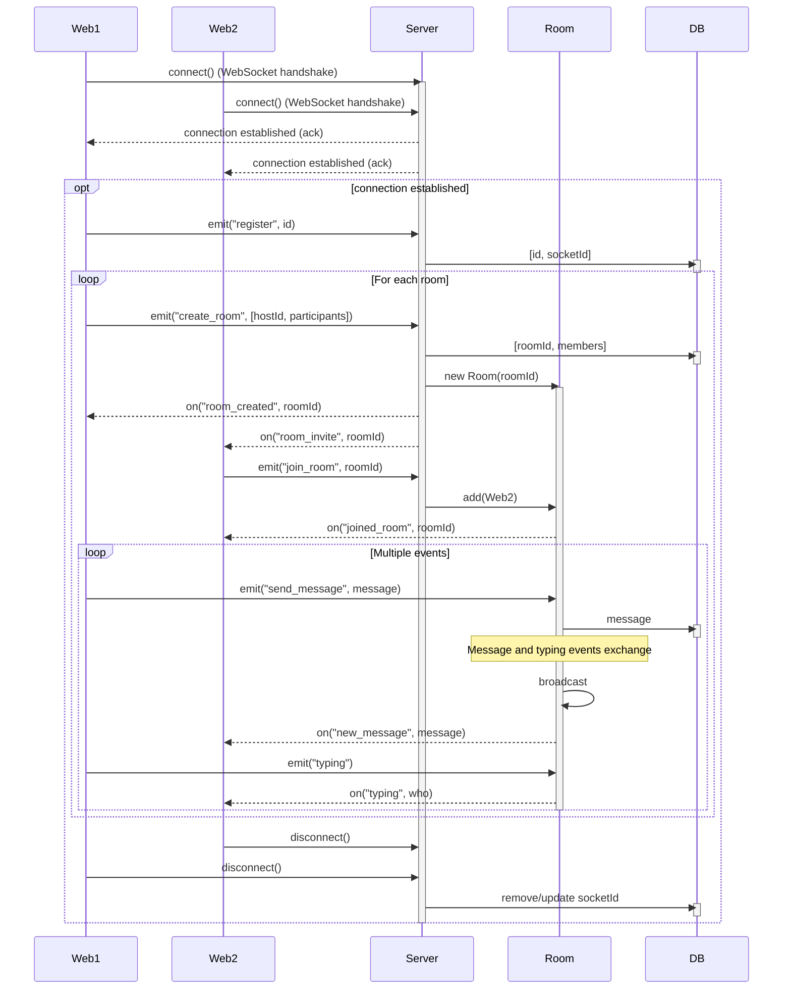

# Socket.io 채팅 서비스 백엔드

## 🛠️ 기술 스택

[](https://socket.io/)  
[](https://redis.io)  
[](https://nestjs.com/) [](https://nodejs.org/ko) [](https://www.typescriptlang.org/)  
[](https://eslint.org/) [](https://prettier.io/)

## 💡 주요 기능

| 기능 | 설명 | 입력 이벤트 | 응답 이벤트 |
| --- | --- | --- | --- |
| 사용자 등록 | 유저ID &harr; 소켓ID 매핑 | emit("register", userId) | on("system", content) |
| 방 생성 | 방 객체 생성 &rarr; 참가자 초대 이벤트 발생 | emit("create_room", <br>&nbsp;&nbsp;&nbsp;&nbsp;&nbsp;&nbsp;&nbsp; [hostId, participants]) | on("room_created", <br>&nbsp;&nbsp;&nbsp;&nbsp;&nbsp; [roomId, participants]) |
| 방 참가 | 방에 사용자 추가 &rarr; 참가 완료 알림 | emit("join_room", <br>&nbsp;&nbsp;&nbsp;&nbsp;&nbsp;&nbsp;&nbsp; [userId, roomId]) | on("system", content) |
| 방 떠나기 | 방에서 사용자 제거 &rarr; 떠남 알림 | emit("leave_room", <br>&nbsp;&nbsp;&nbsp;&nbsp;&nbsp;&nbsp;&nbsp; [userId, roomId]) | on("system", content) |
| 메시지 교환 | 방에서 메시지 중계 | emit("send_message", <br>&nbsp;&nbsp;&nbsp;&nbsp;&nbsp;&nbsp;&nbsp; [roomId, senderId, content] ) | on("receive_message", <br>&nbsp;&nbsp;&nbsp;&nbsp;&nbsp; [senderId, roomId, content]) |
| 타이핑 알림 | 방에서 타이핑 이벤트 중계 | emit("typing", <br>&nbsp;&nbsp;&nbsp;&nbsp;&nbsp;&nbsp;&nbsp; [roomId, userId]) | on("typing", userId) |

## 📐 시퀀스 다이어그램



## 📂 폴더 구조

<details>
<summary>열기</summary>

```
server
├─ .env
├─ src
│  ├─ main.ts
│  ├─ common
│  │  └─ redis.module.ts
│  ├─ core
│  │  ├─ controller.ts
│  │  ├─ gateway.ts
│  │  └─ module.ts
│  ├─ domain
│  │  ├─ user
│  │  │  ├─ controller.ts
│  │  │  ├─ gateway.ts
│  │  │  └─ service.ts
│  │  ├─ chat
│  │  │  └─ gateway.ts
│  │  └─ room
│  │     ├─ gateway.ts
│  │     └─ service.ts
│  └─ repository
│     ├─ interface.ts
│     ├─ module.ts
│     ├─ redis.ts
│     └─ simple.ts
├─ docker-compose.yml
│  ├─ Dockerfile
│  └─ .dockerignore
├─ nest-cli.json
├─ package.json
│  └─ package-lock.json
├─ tsconfig.json
│  └─ tsconfig.build.json
└─ eslint.config.mjs
   └─ .prettierrc
```

</details>

## 🚀 실행 방법

```sh
$ docker run -d \
  --name redis-container \
  --env-file ./.env \
  -p ${REDIS_PORT}:6379 \
  redis:latest

$ npm install
$ npm run start
```
