# Socket.io 채팅 서비스 백엔드

## 🛠️ 기술 스택

[](https://socket.io/)  
[](https://redis.io)
[](https://aws.amazon.com/ko/dynamodb/)
[](https://www.elastic.co/kr/elasticsearch)  
[](https://nestjs.com/) [](https://nodejs.org/ko) [](https://www.typescriptlang.org/)  
[](https://eslint.org/) [](https://prettier.io/)

## 💡 주요 기능

| 기능 | 설명 | 입력 이벤트 | 응답 이벤트 |
| --- | --- | --- | --- |
| 사용자 등록 | 유저ID &harr; 소켓ID 매핑 | emit("register", userId) | on("system", content) |
| 방 생성 | 방 객체 생성 &rarr; 참가자 초대 이벤트 발생 | emit("create_room", <br>&nbsp;&nbsp;&nbsp;&nbsp;&nbsp;&nbsp;&nbsp; [hostId, participants]) | on("room_created", <br>&nbsp;&nbsp;&nbsp;&nbsp;&nbsp; [roomId, participants]) |
| 방 참가 | 방에 사용자 추가 &rarr; 참가 완료 알림 | emit("join_room", <br>&nbsp;&nbsp;&nbsp;&nbsp;&nbsp;&nbsp;&nbsp; [userId, roomId]) | on("system", content) |
| 방 떠나기 | 방에서 사용자 제거 &rarr; 떠남 알림 | emit("leave_room", <br>&nbsp;&nbsp;&nbsp;&nbsp;&nbsp;&nbsp;&nbsp; [userId, roomId]) | on("system", content) |
| 메시지 교환 | 방에서 메시지 중계 | emit("send_message", <br>&nbsp;&nbsp;&nbsp;&nbsp;&nbsp;&nbsp;&nbsp; [roomId, userId, content] ) | on("receive_message", <br>&nbsp;&nbsp;&nbsp;&nbsp;&nbsp; [userId, roomId, content]) |
| 타이핑 알림 | 방에서 타이핑 이벤트 중계 | emit("typing", <br>&nbsp;&nbsp;&nbsp;&nbsp;&nbsp;&nbsp;&nbsp; [roomId, userId]) | on("typing", userId) |
| 메시지 기록 <br>불러오기 | 방 참가 전 메시지 기록 불러오기 |  | on("receive_messages", roomId) |
| 메시지 검색 | 키워드로 메시지 기록 불러오기 | search(keyword) |  |

## 📐 시퀀스 다이어그램



## 📂 폴더 구조

<details>
<summary>열기</summary>

```
server
├─ .env
├─ src
│  ├─ main.ts
│  ├─ common
│  │  ├─ symbols.ts
│  │  ├─ redis
│  │  │  ├─ index.ts
│  │  │  ├─ module.ts
│  │  │  ├─ adapters
│  │  │  │  └─ RedisIoAdapter.ts
│  │  │  └─ providers
│  │  │     ├─ index.ts
│  │  │     ├─ db.provider.ts
│  │  │     ├─ pubsubAdapter.provider.ts
│  │  │     └─ streamsAdapter.provider.ts
│  │  ├─ dynamo
│  │  │  ├─ index.ts
│  │  │  ├─ module.ts
│  │  │  └─ provider.ts
│  │  └─ es
│  │     ├─ index.ts
│  │     ├─ module.ts
│  │     └─ provider.ts
│  ├─ core
│  │  ├─ module.ts
│  │  ├─ eventRegistry.ts
│  │  ├─ controller.ts
│  │  └─ gateway.ts
│  ├─ model
│  │  ├─ Message.ts
│  │  ├─ Room.ts
│  │  └─ schemaDefinition.ts
│  ├─ domain
│  │  ├─ shared
│  │  │  └─ events
│  │  │     ├─ index.ts
│  │  │     ├─ Sync.event.ts
│  │  │     │  └─ Sync.handler.ts
│  │  │     └─ Emit.event.ts
│  │  │        └─ Emit.handler.ts
│  │  ├─ user
│  │  │  ├─ index.ts
│  │  │  ├─ module.ts
│  │  │  ├─ controller.ts
│  │  │  ├─ gateway.ts
│  │  │  ├─ queries
│  │  │  │  ├─ index.ts
│  │  │  │  ├─ GetSocketId.query.ts
│  │  │  │  │  └─ GetSocketId.handler.ts
│  │  │  │  └─ GetUser.query.ts
│  │  │  │     └─ GetUser.handler.ts
│  │  │  └─ commands
│  │  │     ├─ index.ts
│  │  │     ├─ RegisterUser.command.ts
│  │  │     │  └─ RegisterUser.handler.ts
│  │  │     └─ DisconnectUser.command.ts
│  │  │        └─ DisconnectUser.handler.ts
│  │  ├─ chat
│  │  │  ├─ index.ts
│  │  │  ├─ controllers.ts
│  │  │  ├─ gateway.ts
│  │  │  ├─ module.ts
│  │  │  └─ queries
│  │  │     ├─ index.ts
│  │  │     ├─ GetMessageHistory.query.ts
│  │  │     │  └─ GetMessageHistory.handler.ts
│  │  │     └─ SearchMessages.query.ts
│  │  │        └─ SearchMessages.handler.ts
│  │  └─ room
│  │     ├─ index.ts
│  │     ├─ gateway.ts
│  │     ├─ module.ts
│  │     ├─ queries
│  │     │  ├─ index.ts
│  │     │  └─ GetRoomsByUser.query.ts
│  │     │     └─ GetRoomsByUser.handler.ts
│  │     ├─ commands
│  │     │  ├─ index.ts
│  │     │  ├─ CreateRoom.command.ts
│  │     │  │  └─ CreateRoom.handler.ts
│  │     │  ├─ JoinRoom.command.ts
│  │     │  │  └─ JoinRoom.handler.ts
│  │     │  └─ LeaveRoom.command.ts
│  │     │     └─ LeaveRoom.handler.ts
│  │     └─ events
│  │        ├─ index.ts
│  │        ├─ CreatedRoom.event.ts
│  │        │  └─ CreatedRoom.handler.ts
│  │        ├─ JoinedRoom.event.ts
│  │        │  └─ JoinedRoom.handler.ts
│  │        └─ LeavedRoom.event.ts
│  │           └─ LeavedRoom.handler.ts
│  └─ repository
│     ├─ index.ts
│     ├─ module.ts
│     └─ interface.ts
│        ├─ InMemoryRepository.ts
│        └─ DatabaseRepository.ts
├─ docker-compose.yml
│  ├─ Dockerfile
│  └─ .dockerignore
├─ nest-cli.json
├─ package.json
│  └─ package-lock.json
├─ tsconfig.json
│  └─ tsconfig.build.json
└─ eslint.config.mjs
   └─ .prettierrc
```

</details>

## 🚀 실행 방법

```sh
$ docker run -d \
  --name redis-container \
  --env-file .env \
  -p ${REDIS_PORT}:6379 \
  redis:8.2.1

$ docker run -d \
  --name dynamodb-container \
  --env-file .env \
  -p ${DYNAMO_PORT}:8000 \
  amazon/dynamodb-local:3.1.0

$ docker run -d \
  --name es-container \
  --env-file .env \
  -p ${ES_PORT}:9200 \
  docker.elastic.co/elasticsearch/elasticsearch:9.2.0

$ docker build \
  -f Dockerfile \
  -t chat/server:latest \
  .

$ docker run -d \
  --name chat/server \
  --env-file .env \
  -p 3000:3000
  chat/server:latest
```
